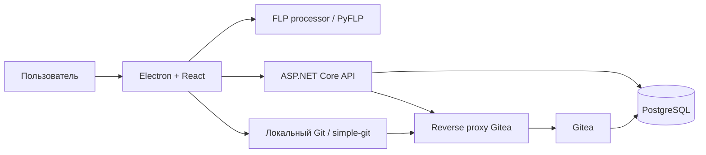

# FruityGit

FruityGit - настольная система контроля версий для проектов FL Studio.
Приложение объединяет Electron-клиент, сервер на ASP.NET Core и Git-хостинг
на базе Gitea.

FruityGit подготавливает проект FL Studio к хранению в Git: упаковывает исходный
`.flp`, доступные сэмплы и извлеченные метаданные проекта. После обработки файлы
можно коммитить, отправлять на сервер и получать на других рабочих станциях.

## Возможности

- Регистрация и вход через ASP.NET Core Identity и JWT.
- Автоматическое создание соответствующего пользователя в Gitea.
- Публичные и приватные репозитории.
- Локальные операции clone, commit, pull и push.
- Обработка проектов `.flp`.
- Добавление найденных сэмплов в состав версии проекта.
- Извлечение базового BPM и информации о плагинах.
- История коммитов со списками добавленных, измененных и удаленных файлов.
- Отображение изменений BPM и состава плагинов.
- Выдача зарегистрированным пользователям права записи в репозиторий.
- Встроенная комплексная диагностика Git и прав доступа.

## Архитектура



### Desktop-приложение

Клиент построен на Electron и React. Renderer-процесс отвечает за интерфейс и
пользовательские сценарии. Файловые и Git-операции выполняются в main-процессе
Electron и доступны renderer-процессу через IPC.

Основные файлы:

- `Desktop/electron-react-app/src/App.js` - главный интерфейс и сценарии.
- `Desktop/electron-react-app/src/Git/GitService.js` - клиентская Git-логика.
- `Desktop/electron-react-app/main.js` - запуск Electron и IPC-обработчики.
- `Desktop/electron-react-app/preload.js` - API контекстного моста Electron.

### Backend

Сервер представляет собой приложение ASP.NET Core 9 и отвечает за:

- учетные записи пользователей;
- выдачу JWT и refresh token;
- создание пользователей и API-токенов Gitea;
- хранение метаданных репозиториев;
- управление правами соавторов;
- проксирование Gitea API и Git Smart HTTP через `/gitea`.

Сервер не выполняет локальные Git-команды. Clone, commit, pull и push запускаются
клиентом через Git, установленный на компьютере пользователя.

### Gitea и PostgreSQL

Gitea хранит Git-репозитории. PostgreSQL используется Gitea, ASP.NET Core
Identity и серверным слоем метаданных.

Стандартная конфигурация Docker Compose открывает следующие адреса:

| Сервис | Адрес | Назначение |
| --- | --- | --- |
| FruityGit API | `http://localhost:3000` | Основной backend |
| Gitea через proxy | `http://localhost:3000/gitea` | Gitea API и Git HTTP |
| Gitea напрямую | `http://localhost:3001` | Отладочный доступ |
| PostgreSQL | `localhost:5432` | База данных |
| Gitea SSH | `localhost:2222` | Опциональный Git SSH |

## Обработка FL Studio проектов

При выборе `.flp` Electron запускает встроенный Python-процессор. Процессор
создает ZIP-архив во временной директории операционной системы. Архив содержит:

- исходный `.flp`;
- сэмплы, пути к которым удалось разрешить на текущем компьютере;
- `.fruitygit-flp-meta.json` с метаданными проекта.

Пример метаданных:

```json
{
  "schemaVersion": 1,
  "flpFile": "MyProject.flp",
  "baseBpm": 128,
  "plugins": {
    "generators": ["Serum", "FLEX"],
    "effects": ["Fruity Limiter"]
  },
  "samples": [
    "C:\\Samples\\kick.wav"
  ]
}
```

Архив распаковывается в стабильную директорию:

```text
uploads/<project-name>/
```

Благодаря стабильному пути Git может корректно определять добавленные,
измененные и удаленные файлы между версиями проекта.

Извлечение метаданных работает в режиме best effort. Если PyFLP не поддерживает
версию или отдельные элементы проекта, FruityGit все равно сохраняет исходный
`.flp`.

## Структура репозитория

```text
FruityGitDesktop/
|-- Desktop/
|   `-- electron-react-app/
|       |-- public/                    Статические ресурсы React
|       |-- resources/python-app/      FLP processor и PyFLP
|       |-- src/                       React-приложение
|       |-- main.js                    Main-процесс Electron
|       |-- preload.js                 Context bridge
|       |-- forge.config.js            Сборка Electron Forge
|       `-- package.json
|-- src/
|   `-- FruityGitServer/
|       |-- Authentication/            JWT и обработка токенов
|       |-- Context/                   Entity Framework Core
|       |-- Controllers/               HTTP API
|       |-- DTOs/                      Контракты API
|       |-- Middleware/                Ошибки и Gitea proxy
|       |-- Migrations/                Миграции PostgreSQL
|       |-- Models/                    Модели пользователей и репозиториев
|       |-- Repositories/              Доступ к метаданным
|       |-- Services/                  Сервисы Git и Gitea
|       `-- Program.cs
|-- docker-compose.yml
`-- FruityGitDesktop.sln
```

## Требования

### Сервер

- Docker Desktop с Docker Compose;
- либо .NET 9 SDK, PostgreSQL и отдельно настроенная Gitea.

### Desktop-клиент

- Windows как основная поддерживаемая платформа;
- Node.js и npm;
- Git, доступный через `PATH`;
- Python 3.12 только для запуска Python-исходника или пересборки процессора.

Упакованное приложение использует `flp_processor.exe` и не требует отдельной
установки Python.

## Запуск сервера

В корне репозитория выполните:

```powershell
docker compose up -d --build
```

Проверить состояние контейнеров:

```powershell
docker compose ps
```

Проверить backend:

```powershell
Invoke-WebRequest http://localhost:3000/health
```

Посмотреть логи:

```powershell
docker compose logs -f fruitygitserver
docker compose logs -f gitea
docker compose logs -f postgres
```

Остановить сервер:

```powershell
docker compose down
```

Остановить сервер и удалить данные PostgreSQL и Gitea:

```powershell
docker compose down -v
```

Команда с `-v` безвозвратно удаляет базы данных и Git-репозитории.

### Первичная настройка Gitea

Текущая конфигурация ожидает, что Gitea и административный токен подготовлены
корректно. При развертывании на чистом окружении необходимо проверить:

1. В PostgreSQL существует база данных, указанная для Gitea.
2. Первичная установка Gitea завершена.
3. Создан администратор Gitea и его API-токен.
4. `Gitea__AdminToken` сервиса `fruitygitserver` содержит этот токен.
5. Внешний `ROOT_URL` Gitea указывает на `http://localhost:3000/gitea` либо на
   фактический адрес сервера.

Не используйте учетные данные из текущего `docker-compose.yml` в публичном или
production-окружении.

## Запуск Desktop-приложения

Установить зависимости:

```powershell
Set-Location Desktop/electron-react-app
npm install
```

Запустить React и Electron:

```powershell
npm run dev
```

React dev server использует порт `3002`. После его запуска Electron автоматически
откроет окно приложения.

Стандартный адрес backend:

```text
http://localhost:3000
```

Адрес можно изменить в настройках FruityGit, например при подключении к серверу
на другом компьютере локальной сети.

## Сборка Desktop-приложения

Production-сборка React:

```powershell
npm run build
```

Создание распакованного Electron-приложения:

```powershell
npm run package
```

Создание установщика или платформенного пакета:

```powershell
npm run make
```

## Пересборка FLP processor

Установите Python 3.12 и зависимости:

```powershell
py -3.12 -m pip install -U pyinstaller construct construct-typing sortedcontainers typing_extensions
```

Соберите исполняемый файл:

```powershell
npm run build:python-exe
```

Ожидаемый результат:

```text
Desktop/electron-react-app/resources/python-app/dist/flp_processor.exe
```

При упаковке Electron этот файл добавляется в ресурсы приложения.

## Типичный сценарий работы

1. Запустить серверный стек Docker Compose.
2. Запустить Desktop-приложение.
3. Зарегистрироваться или выполнить вход.
4. Создать либо выбрать репозиторий.
5. Выбрать локальную директорию для клонирования.
6. Прикрепить `.flp`.
7. Создать локальный коммит подготовленных файлов.
8. Отправить коммит на сервер.
9. На других рабочих станциях получить изменения через pull.

Владелец репозитория может выдать право записи другому зарегистрированному
пользователю, указав его email.

## API

### Аутентификация

| Метод | Endpoint | Назначение |
| --- | --- | --- |
| `POST` | `/api/auth/register` | Создание Identity- и Gitea-пользователя |
| `POST` | `/api/auth/login` | Получение JWT, refresh token и Gitea token |
| `POST` | `/api/auth/refresh` | Обновление JWT и refresh token |
| `POST` | `/api/auth/logout` | Отзыв refresh token |
| `GET` | `/api/auth/validate` | Проверка JWT |
| `GET` | `/api/auth/search` | Поиск зарегистрированных пользователей |

### Репозитории и права

Endpoint-ы `/api/git` требуют Bearer JWT.

| Метод | Endpoint | Назначение |
| --- | --- | --- |
| `POST` | `/api/git/{repo}/init` | Создание метаданных репозитория |
| `POST` | `/api/git/repositories` | Получение метаданных репозиториев |
| `POST` | `/api/git/{repo}/url` | Получение URL репозитория Gitea |
| `POST` | `/api/git/{repo}/delete` | Удаление метаданных |
| `POST` | `/api/git/{owner}/{repo}/allow-user` | Выдача права записи |

Текущая версия Desktop-клиента создает и перечисляет репозитории напрямую через
проксированный Gitea API. Серверные endpoint-ы метаданных сохранены, но пока не
являются основным источником списка репозиториев.

## Конфигурация

Основные настройки backend:

| Параметр | Назначение |
| --- | --- |
| `DB_HOST` | Адрес PostgreSQL |
| `POSTGRES_DB` | База данных ASP.NET Core |
| `POSTGRES_USER` | Пользователь PostgreSQL |
| `POSTGRES_PASSWORD` | Пароль PostgreSQL |
| `Gitea__BaseUrl` | Внутренний адрес Gitea |
| `GITEA_PUBLIC_URL` | Публичный адрес Gitea |
| `Gitea__AdminToken` | Административный API-токен Gitea |
| `Jwt__Secret` | Секрет подписи JWT |
| `Jwt__ExpiryMinutes` | Время жизни access token |
| `LOKI_URL` | Опциональный адрес Grafana Loki |
| `APP_NAME` | Метка приложения в логах |

Для вложенных настроек ASP.NET Core используются двойные подчеркивания:

```text
Jwt__Secret=<strong-random-secret>
Gitea__AdminToken=<gitea-admin-token>
```

## Безопасность

Значения в `docker-compose.yml` и `appsettings*.json` предназначены только для
локальной разработки. Перед развертыванием вне изолированного окружения:

- замените пароли PostgreSQL и секреты JWT;
- отзовите и замените сохраненный в репозитории admin token Gitea;
- перенесите секреты в переменные окружения или secrets manager;
- включите HTTPS;
- ограничьте CORS доверенными адресами;
- закрепите протестированную версию Docker-образа Gitea вместо `latest`;
- проверьте доступ renderer-процесса Electron к файловой системе;
- исключите сохранение токенов в Git remote URL;
- проверьте назначение ролей при регистрации и доступ к поиску пользователей.

Git HTTP-аутентификация сейчас встраивает Gitea token в remote URL. Из-за этого
токен может сохраняться в `.git/config` локального клона. До перехода на
credential helper или короткоживущие учетные данные локальные репозитории следует
считать содержащими чувствительные данные.

## Тестирование и диагностика

Автоматическое покрытие тестами пока минимально. `App.test.js` является
стандартным шаблоном Create React App, а в `package.json` отсутствует скрипт
`test`.

В окне настроек доступна комплексная диагностика, проверяющая:

- health endpoint backend и доступность Gitea proxy;
- наличие локального Git;
- создание публичного и приватного репозитория;
- clone, commit, push и pull;
- определение добавленных, измененных и удаленных файлов;
- доступ к приватному репозиторию до и после выдачи прав;
- отправку коммита соавтором.

Диагностика создает временные репозитории и временного пользователя. Удаление
репозиториев выполняется в режиме best effort. Созданный пользователь в текущей
версии автоматически не удаляется.

## Решение проблем

### Git не найден

Установите Git for Windows, убедитесь, что `git.exe` доступен через `PATH`, и
перезапустите FruityGit.

### Клиент не подключается к серверу

Проверьте адреса:

```powershell
Invoke-WebRequest http://localhost:3000/health
Invoke-WebRequest http://localhost:3000/gitea/api/v1/version
```

При удаленном размещении замените `localhost` на hostname или IP сервера и
обновите адрес в настройках FruityGit.

### Вход работает, но операции с репозиториями завершаются ошибкой

Проверьте:

- наличие Gitea token в ответе login;
- существование пользователя в Gitea;
- scopes токена для чтения и записи репозиториев;
- актуальность `Gitea__AdminToken`;
- согласованность `ROOT_URL` Gitea и proxy-префикса `/gitea`.

### Для FLP не создаются метаданные

Исходный `.flp` все равно должен попасть в архив. Метаданные могут отсутствовать,
если PyFLP не поддерживает версию FL Studio или структуру отдельных событий и
плагинов. Подробности выводятся в логи main-процесса Electron.

### В архив не попали сэмплы

FruityGit добавляет только те файлы, пути к которым удалось разрешить на текущем
компьютере. Переменные FL Studio, перемещенные файлы, сетевые пути и относительные
ссылки могут потребовать исправления путей перед обработкой.

## Статус проекта

Основной пользовательский сценарий реализован. Приоритетные направления
дальнейшей работы:

- безопасное хранение секретов и Git-учетных данных;
- автоматическая первичная настройка Gitea;
- автоматические тесты;
- синхронизация серверных метаданных с Gitea;
- разделение крупных модулей `App.js` и `main.js`;
- обработка Git-конфликтов и веток;
- улучшение совместимости с разными версиями FL Studio.
